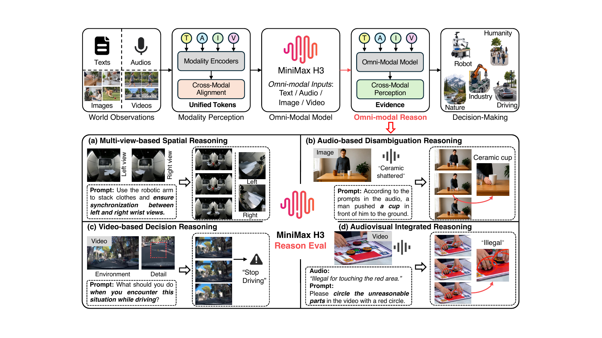
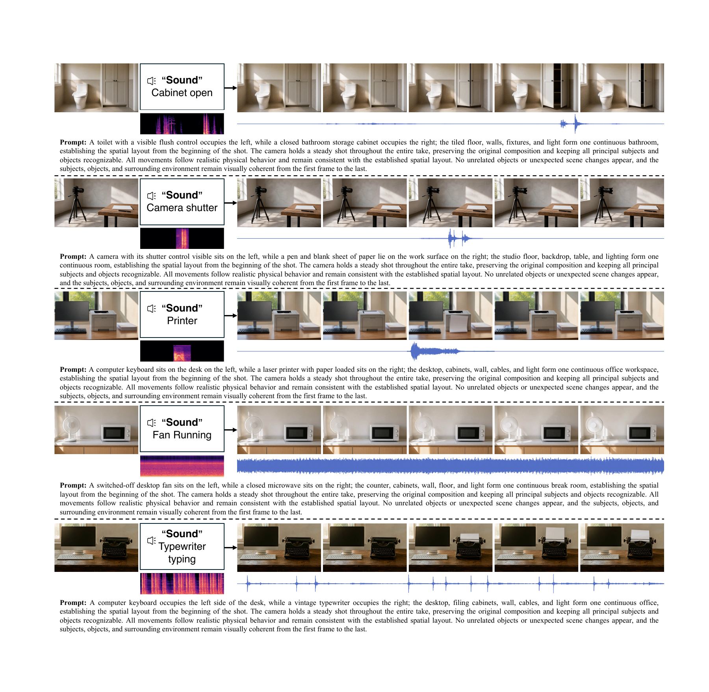

# MiniMax-H3-Reason

## Can MiniMax-H3 Reason About the Physical World?
### An Evaluation of Omni-Modal Generative Model

**Can a generative model infer what it should generate from complementary multimodal evidence?**

We study physical-world reasoning through video generation, continuation, and editing. Instead of describing the complete target event, our prompts leave task-relevant information to be inferred from images, audio, and video. We evaluate whether generated outputs satisfy the semantic constraints supported by those observations.

**517 evaluation instances · 4 reasoning scenarios · 29 subcategories · 41.97% overall success rate**

[Overview](#overview) · [Reasoning scenarios](#reasoning-scenarios) · [Results](#results) · [Evaluation protocol](#evaluation-protocol) · [Resources](#resources) · [Authors](#authors)

## Overview

Our evaluation asks whether a model can recover task-relevant information that is left unstated in the text prompt. Depending on the task, this involves integrating multiple views, identifying an event from its sound, anticipating a response to observed dynamics, or grounding auditory constraints in video.

The framework provides:

- **Implicit task prompts:** the requested generation operation is specified, while the target inference remains grounded in the observations.
- **Complementary evidence:** four scenarios test spatial, temporal, and audiovisual relationships.
- **Task-specific evaluation:** experts assess whether the generated video satisfies the intended semantic requirement, allowing multiple valid visual realizations.

Our central finding is that **supporting multimodal inputs does not ensure reliable task completion**. MiniMax-H3 succeeds on 41.97% of the 517 evaluated instances.

## Reasoning scenarios

All scenarios include a text prompt.

| Scenario | Additional inputs | What a successful output must demonstrate | Instances | Subcategories |
| --- | --- | --- | ---: | ---: |
| **MSR** — Multi-view Spatial Reasoning | Multiple images | Preserve spatial relationships and coordinated actions across complementary views | 200 | 10 |
| **ADR** — Audio-based Disambiguation Reasoning | Image + audio | Resolve visual ambiguity and depict the event supported by the acoustic cue | 146 | 6 |
| **VDR** — Video-based Decision Reasoning | Prefix video | Continue observed dynamics with an appropriate response to the task | 100 | 8 |
| **AVIR** — Audiovisual Integrated Reasoning | Video + audio | Incorporate auditory evidence or spoken constraints into continuation or editing | 71 | 5 |
| **Total** | | | **517** | **29** |

For example, ADR may present several candidate sound sources in an image. The model must associate the supplied sound with the correct object and express that interpretation through the generated event. AVIR extends audio grounding to temporally evolving video, including the localization of content that conflicts with spoken constraints.

## Results

Human-evaluated success rates for MiniMax-H3, as reported in the manuscript:

| Scenario | Instances | Success rate ↑ |
| --- | ---: | ---: |
| MSR | 200 | 43.50% |
| ADR | 146 | 27.40% |
| VDR | 100 | **56.00%** |
| AVIR | 71 | 47.89% |
| **Overall** | **517** | **41.97%** |

The overall rate is calculated over all instances, not as an unweighted average of the four scenario rates.

- **VDR has the highest success rate** in this evaluation; ADR has the lowest.
- **Audio grounding remains challenging.** Selected failures include associating a sound with the wrong visible source and confusing similar mechanical sounds.
- **Visual plausibility is insufficient.** A generated video can look convincing while failing the required spatial, temporal, or audiovisual condition.

The scenarios differ in data, prompts, and generation targets. Their success rates describe task-level performance and are not a controlled comparison of the intrinsic value of different modalities.

## Qualitative examples

Representative ADR results from the manuscript show cabinet-opening and typewriter events guided by acoustic inputs. These are static frames from the qualitative analysis; playable input and output clips are not included in the current repository.

The manuscript also documents unsuccessful outputs. In one ADR example, a cat-meowing input causes the dog to open its mouth while the cat remains largely inactive, illustrating a mismatch between the acoustic cue and its visible source.

## Evaluation protocol

1. **Construct the instance.** Pair multimodal observations with an implicit prompt and an annotated semantic target.
2. **Verify the evidence.** Experts check whether the observations support the intended inference and whether the prompt leaves that inference unstated.
3. **Generate the output.** Use the task's observations and prompt for video generation, continuation, or editing.
4. **Assess task satisfaction.** Three experts independently judge each output and then cross-check their assessments against the inputs and task instructions.

Success rate is the number of successful instances divided by the number of evaluated instances, multiplied by 100. Evaluation permits multiple valid outputs rather than requiring a match to one reference video.

Generated outputs provide behavioral evidence about the complete generation process. They do not directly expose an internal reasoning mechanism; failures may arise from perception, evidence integration, or generation.

## Resources

This repository currently provides the research overview, aggregate results, and selected manuscript figures.

| Resource | Link / status |
| --- | --- |
| Research summary and aggregate results | Included in this README |
| Overview and qualitative figures | Included in `docs/assets/` |
| Project page | Local design drafts under `planning/design-demos/`; public URL pending |
| Paper | [arXiv:2609.18323](https://arxiv.org/abs/2609.18323) |
| Evaluation dataset | [MiniMax-H3-Reason on Hugging Face](https://huggingface.co/datasets/gulucaptain/MiniMax-H3-Reason) |
| Generated video clips | Not included yet |
| Evaluation code and reproducibility instructions | Not included yet |

No installation or evaluation commands are provided until executable code is available. This repository does not contain model weights.

## Authors

Haoyu Zhao1,*,†, Zihao Zhao1,*, Tianyu Deng1,*, Ziqin Xu1,*, Zihao Zhang2, Xudong Wang1, Jinxiang Guo1, Chen Gao1, Xiaobin Hu1, Ziyi Ye2, Yeying Jin3,‡, Jiaxi Gu3,‡, Zuxuan Wu2, Shuicheng Yan1

1 National University of Singapore · 2 Fudan University · 3 Tencent

* Equal contribution · † Project lead · ‡ Corresponding authors

## Citation

Please refer to our paper, [Can MiniMax-H3 Reason About the Physical World? An Evaluation of Omni-Modal Generative Model](https://arxiv.org/abs/2609.18323), when citing this work.

## Data sources and usage

The manuscript draws on real and synthetic visual and acoustic sources. Named dataset sources include HiFi-UMI-2K, VISTA-UMI-5K, HuMI-Unsheathe, Hy-Embodied-0.5-VLA-Data, 10Kh-RealOmin-OpenData, LLaVA-Video-178K, FSD50K, and ESC-50. Full bibliographic details are provided in the manuscript.

No repository license has been specified yet. Refer to the respective source datasets for their usage terms; this repository does not grant additional rights to third-party materials.
