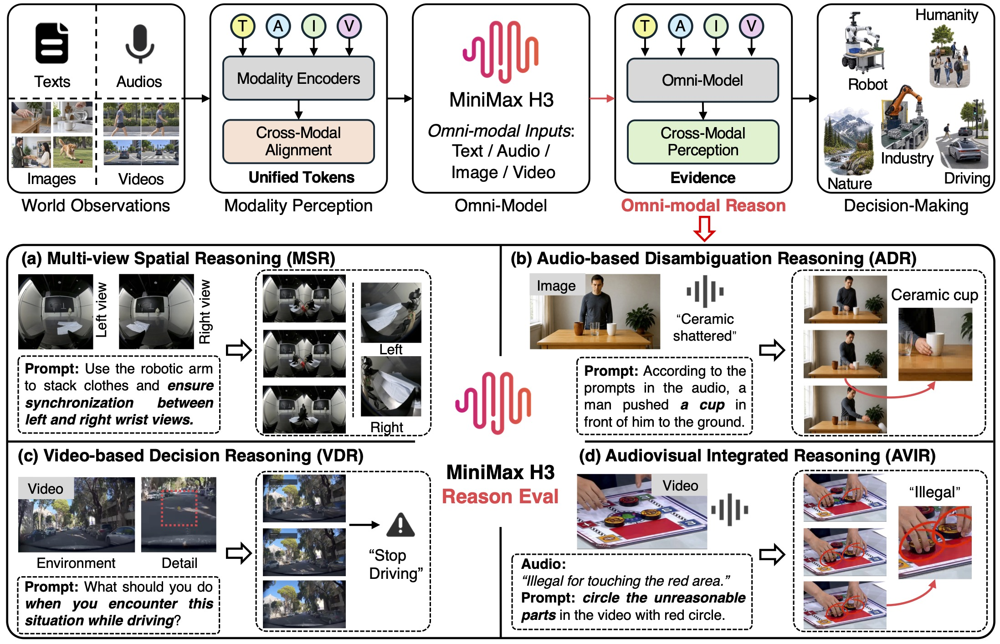
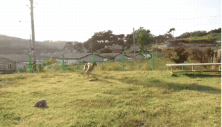
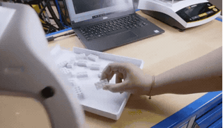

# MiniMax-H3-Reason toolkit

[中文（default）](../README.md) | **English**

[Paper](https://arxiv.org/abs/2609.18323) · [Hugging Face data](https://huggingface.co/datasets/gulucaptain/MiniMax-H3-Reason) · [Full usage guide](USAGE.en.md) · [Research overview and results](PROJECT.en.md)

Hugging Face hosts the 517 benchmark tasks, 734 source media files, references and audio evidence. This GitHub repository hosts the downloader, SDK, generation-adapter interface, submission importer/validator and automated evaluation for ADR, VDR, AVIR and MSR. Existing paper illustration assets are retained; they are not benchmark inputs.

## Research overview

**Can a generative model infer what it should generate from complementary multimodal evidence?** MiniMax-H3-Reason studies this question through physical-world spatial, temporal and audiovisual reasoning. Prompts specify video generation, continuation or editing, while task-relevant information must be inferred from images, audio or video observations.

The benchmark contains **517 tasks across 4 scenarios and 29 subcategories**. Evaluation checks whether an output satisfies the semantic conditions supported by the evidence, allowing multiple valid visual realizations rather than requiring a pixel-level match to one reference video.



| Scenario | Inputs (all include a text prompt) | Task objective | Tasks | Subcategories |
|---|---|---|---:|---:|
| ADR — Audio-based Disambiguation Reasoning | Image + audio | Resolve visual ambiguity using sound and generate the supported event | 146 | 6 |
| VDR — Video-based Decision Reasoning | Prefix video | Anticipate and continue an appropriate response to observed dynamics | 100 | 8 |
| AVIR — Audiovisual Integrated Reasoning | Video + audio | Mark audiovisual contradictions with red circles, or predict subsequent events | 71 | 5 |
| MSR — Multi-view Spatial Reasoning | One image containing two views | Preserve spatial relationships and coordinated actions across views | 200 | 10 |

AVIR includes 48 contradiction-annotation tasks and 23 future-prediction tasks. Each task's prompt and task fields specify the required operation.

## Paper results and generated examples

MiniMax-H3 achieves a **41.97% overall human-evaluated success rate** across the 517 tasks in the paper. Supporting multimodal inputs does not by itself ensure reliable evidence-grounded generation.

| Scenario | Human-evaluated success rate in the paper |
|---|---:|
| ADR | 27.40% |
| VDR | 56.00% |
| AVIR | 47.89% |
| MSR | 43.50% |
| All tasks | 41.97% |

The overall rate is calculated across all tasks. These are human-evaluated paper results; automated judge scores produced by the toolkit below should be reported separately with the judge model and configuration.

Selected successful VDR generations from the paper are shown below. Click a preview to open the full video:

<p align="center">
  <a href="../assets/videos/VDR-004.mp4"></a>
  <a href="../assets/videos/VDR-006.mp4"></a>
  <a href="../assets/videos/VDR-011.mp4"></a>
</p>

<p align="center">
  <a href="../assets/videos/VDR-013.mp4"></a>
  <a href="../assets/videos/VDR-025.mp4"></a>
  <a href="../assets/videos/VDR-058.mp4"></a>
</p>

See [the full research introduction](PROJECT.en.md) for more examples, the human evaluation protocol and data sources. The following sections explain how to evaluate your own video generation model on this benchmark.

## Install and download

Use Python 3.10+ and run from the GitHub project root:

```bash
git clone https://github.com/gulucaptain/MiniMax-H3-Reason.git
cd MiniMax-H3-Reason
python3 -m pip install -r requirements.txt
python3 sdk/download_dataset.py
```

The downloader resolves the requested revision to a fixed Hub commit, downloads `data/` and `media/`, validates manifest/reference hashes and records `download_metadata.json`. The default local data root is `datasets/MiniMax-H3-Reason/`, excluded from Git. To pin data, use `--revision COMMIT_SHA --output-dir /path/to/data`. Existing output directories are never overwritten. To use existing local data, pass `--dataset-root /path/to/data` to import/evaluation commands.

## Generate or import outputs

Implement `ModelAdapter.generate(request, output_root)` using [the adapter example](../examples/model_adapter.py). `load_cases()` exposes the same fields and `local_path` inputs for all scenarios. Provider-specific generation/upload/polling is implemented by participants; there is no built-in universal generation-service API. Never supply references or audio descriptions to the evaluated model.

Alternatively, import videos named with their case IDs:

```bash
python3 sdk/create_submission.py \
  --videos-dir /path/to/generated_videos --output-dir my_submission \
  --model-id my-video-model --model-version 1.0
python3 evaluate.py --submission my_submission/outputs.jsonl \
  --report-dir checks --dry-run
```

Fill actual preprocessing, generation parameters and seed in submission metadata. Missing outputs remain `skipped` in the denominator. Dry runs are local and do not call a judge or compute success rates. AVIR annotation and prediction use separate task protocols; VDR/AVIR prediction with prefix uses `--vdr-layout with_prefix` / `--avir-layout with_prefix` at import.

## Configure a judge and score

Profiles for DeepSeek, Kimi, OpenAI/GPT and compatible services are in `configs/judges/`. Choose an image-capable judge and adjust settings for your account. Example:

```bash
cp configs/judges/openai.json judge_config.json
python3 evaluate.py --judge-config judge_config.json --check-judge --prompt-key
python3 evaluate.py --submission my_submission/outputs.jsonl \
  --judge-config judge_config.json --prompt-key --report-dir evaluation_results
```

Keys are supplied by participants through hidden input or the configured environment variable; never commit them. Generation credentials and judge credentials are independent. Preflight and scoring call your judge and may incur charges. Test a subset with `--case-ids`; use `--resume` after interruption or errors. Exact configuration and scoring protocols: [full guide](USAGE.en.md).

`summary.json` reports per-scenario `task_success_rate=pass/n`, retaining unknown, unsuccessful, unsupported and skipped cases, plus coverage and AVIR subtask metrics. Judge errors and incomplete runs produce null affected success rates rather than model failures. Reports record data/reference hashes, judge/sampling settings, evaluator version, code-content hash and Git commit. Downloads made through the helper also record the resolved Hub commit; manually supplied data are marked local when no revision is known. Code-content hashes distinguish uncommitted edits.

## Offline tests

```bash
python3 -m unittest discover -s tests -v
```

Tests use synthetic media and mocked judges, not real model APIs. Dataset publication checks require downloaded data or `MINIMAX_H3_DATASET_ROOT`; they are skipped when no dataset is present. Submission templates are tied to the current manifest; use the importer to generate submissions for another data revision.

See [the paper/project documentation](PROJECT.en.md) for citation and original human-evaluated results, which should not be conflated with automated judge scores.
